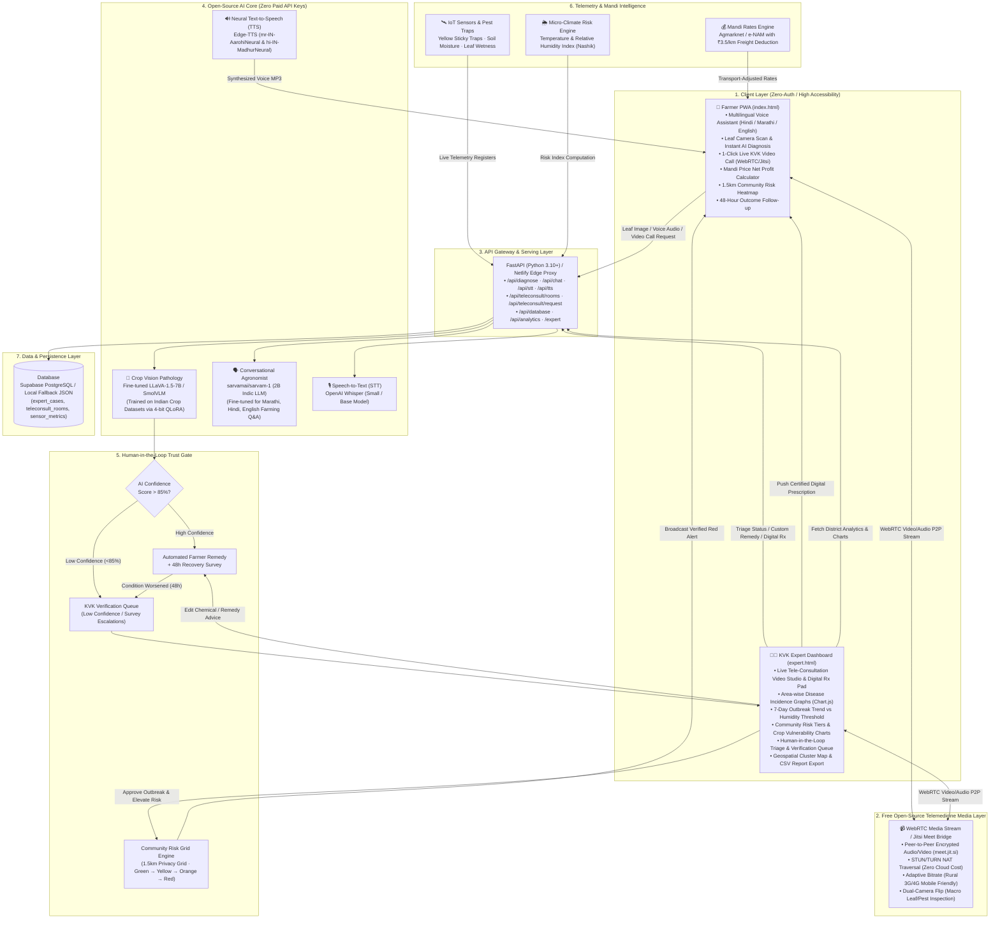
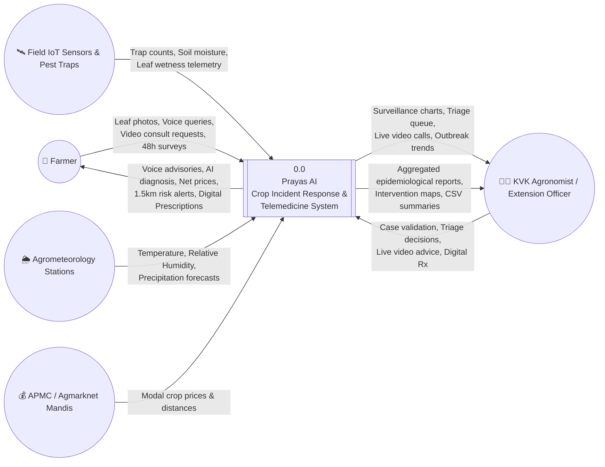
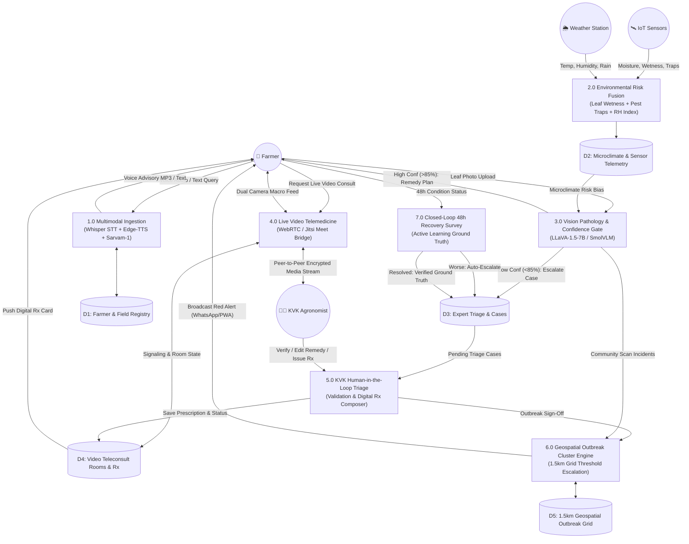
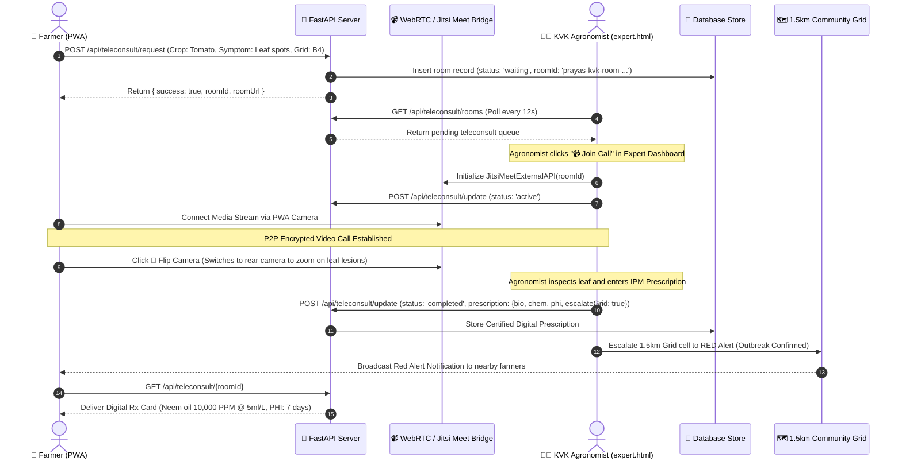

# Prayas AI — खेती साथी (Smart Crop Incident Response System)

[](https://prayas-ai.netlify.app/)
[](https://prayas-ai.netlify.app/)
[](LICENSE)
[](https://meet.jit.si)

**Prayas AI** is a voice-first, community-driven Progressive Web App (PWA) with built-in real-time plant telemedicine, designed for early crop disease detection, microclimate risk forecasting, and localized Integrated Pest Management (IPM).

Developed for **Problem Statement ID 26131** under the **Government of Maharashtra (Department of Skills, Employment, Entrepreneurship and Innovation)** for the *Agriculture, FoodTech & Rural Development* track.

---

## 📋 Problem Statement & Expected Outcomes

### Problem Description
> *Farmers often recognise crop diseases or pest infestations only after visible damage has spread. Extension staff may cover large areas, while laboratory diagnosis and expert advice may not be immediately available. Weather, crop stage, variety, soil condition and local pest history influence risk, but these inputs are rarely combined into actionable farm-level alerts. Incorrect diagnosis may lead to delayed treatment, excessive or inappropriate pesticide use, increased cultivation cost, residue concerns and yield loss. The challenge is to provide timely, reliable and locally relevant detection, forecasting and management support.*

### Expected Solution / Outcome
> *A farmer- and extension-worker-friendly crop-health system that supports image-based symptom identification, pest-trap or sensor inputs, weather-based risk forecasting, geospatial hotspot mapping, expert validation and multilingual advisories. The system should recommend integrated pest and disease management actions, safe input usage, referral to extension or laboratories, and follow-up monitoring. It should learn from field confirmations and provide dashboards for agriculture officials. Expected outcomes include earlier detection, reduced crop loss, more targeted pesticide use, faster extension response, improved surveillance coverage and better planning of preventive interventions.*

---

## 1. Project Vision & Closed-Loop Architecture

While many tools exist for standalone disease diagnosis, they lack a unified action response system. **Prayas AI** closes the loop by connecting farmers, IoT sensors, open-source AI models, and agricultural scientists into a single, trust-gated system:

```
[Farmer Camera Scan / IoT Sensors] 
                 │
                 ▼
    [Fine-Tuned LLaVA / SmolVLM] ──(Low Confidence < 85%)──► [KVK Live Video / Triage Queue]
                 │                                                          │
         (High Confidence)                                        (Video Consultation & Rx)
                 │                                                          │
                 ▼                                                          ▼
       [Community Geo-Grid Map] ◄───────────────────────────────── [Red Alert Broadcast]
                 │
                 ▼
    [Feasibility Action Planner] (Transport-adjusted Mandi Prices & Nearest Store)
                 │
                 ▼
       [48-Hour Outcome Survey] ──(Condition Worse)──────────► [Escalate to Live Video Call]
```

### Key Differentiators
1. **Dedicated KVK Expert Command Center**: A separate agronomist portal (`expert.html`) featuring area-wise disease graphs, outbreak thresholds, risk tier donuts, 1-click verification queue, and a **Live Video Tele-Consultation Studio**. Zero authentication required—directly accessible from the farmer app.
2. **Free Open-Source Video Tele-Consultation (WebRTC / Jitsi Meet)**: 1-click encrypted, low-bandwidth plant telemedicine connecting farmers directly to KVK scientists from the field with dual-camera flipping for leaf inspection and instant digital prescriptions.
3. **Human-in-the-Loop Validation Gate**: To prevent false-alert fatigue, low-confidence AI scans and grid-level escalations are routed to Krishi Vigyan Kendra (KVK) officers before community red alerts are broadcast.
4. **Hyperlocal Threshold-Gated Alerts**: Risk tiers (Green → Yellow → Orange → Red) escalate dynamically on an interactive Leaflet map only when clusters occur within a 1.5km grid cell.
5. **Feasibility-Aware Action Planner**: Recommendations include safe/organic inputs (e.g. Neem oil), cost estimates per acre, specific application timings, Pre-Harvest Intervals (PHI), and nearest agricultural supply centers.
6. **Transport-Cost Adjusted Mandi Prices**: Real-time market rates adjusted for travel distance and freight cost (₹3.5/km/quintal) so farmers compare *net profit* rather than nominal prices.
7. **Closed-Loop 48-Hour Follow-up & Active Learning**: Surveys post-treatment recovery. Worsening conditions auto-escalate to KVK video calls; confirmed cases feed ground-truth data back into model retraining.

---

## 2. Updated System Architecture Diagram & Tech Stack

The diagram below represents the complete end-to-end open-source architecture of Prayas AI:



### Detailed Tech Stack Breakdown

| Layer | Component | Technology | Role & Key Features |
| :--- | :--- | :--- | :--- |
| **Farmer Frontend** | Progressive Web App (PWA) | Vanilla HTML5, CSS3, JavaScript | Lightweight offline-first PWA, service worker caching, 1-click video call, zero installation overhead. |
| **Expert Frontend** | KVK Agronomist Dashboard | `expert.html`, Chart.js, Leaflet.js | Dedicated desktop/tablet portal with live video studio, digital prescription pad, disease charts, risk donuts, and 1-click verification. |
| **Video Telemedicine** | Tele-Consultation Bridge | WebRTC / Jitsi Meet Open Embed API | 100% Free, zero-cost peer-to-peer encrypted video, adaptive rural bandwidth, dual-camera flip. |
| **Backend Engine** | API Gateway & Serving | FastAPI (Python 3.10+) & Netlify Functions | High-concurrency async framework serving AI models, static assets, and telemetry/teleconsult APIs. |
| **Crop Vision** | Disease Diagnosis | Fine-tuned LLaVA-1.5-7B / SmolVLM | 4-bit QLoRA fine-tuned on Kaggle Indian Crop Disease datasets for leaf pathology. |
| **Voice LLM** | Regional Farm Assistant | `sarvamai/sarvam-1` (2B Indic LLM) | Open-weights model optimized for Hindi and Marathi agronomy Q&A. |
| **Speech-to-Text** | Voice Transcription | OpenAI Whisper | High-accuracy transcription for noisy rural environments. |
| **Text-to-Speech** | Regional Voice Synthesis | Edge-TTS Neural Voices | Natural Marathi (`mr-IN-AarohiNeural`) & Hindi (`hi-IN-MadhurNeural`) audio. |
| **Geospatial Grid** | Community Risk Mapping | Leaflet.js & OpenStreetMap | 1.5km privacy-preserving cluster grid preventing individual farm exposure. |
| **Data Storage** | Database & Cache | Supabase PostgreSQL / Local JSON | Persistent stores for `expert_cases`, `teleconsult_rooms`, `reports`, and `sensor_metrics`. |

---

## 3. Data Flow Diagrams (DFD)

### DFD Level 0 — Context Diagram
Shows the boundary of Prayas AI with external entities (Farmer, KVK Extension Officer, IoT Sensors, Agrometeorology Weather Station, APMC Mandi):



---

### DFD Level 1 — System Decomposition Diagram
Decomposes the primary processes, data transformations, and data stores:



---

### DFD Level 2 — Detailed Video Tele-Consultation Lifecycle
Focuses on the exact data transformations during a live expert video call:



---

## 4. Product USPs (Mapped to Problem Statement & Expected Outcomes)

| # | Specific Problem Statement Pain Point | How Existing Solutions Fail | Prayas AI Solution & Core USP | Tangible Impact / Metric |
| :- | :--- | :--- | :--- | :--- |
| **1** | **Late Disease Recognition**: Farmers recognize crop diseases or pest infestations only after visible damage has spread. | Standalone image classifiers only work after extensive leaf necrosis or defoliation has already occurred. | **Multi-Source Pre-Symptomatic Risk Fusion**: Combines leaf wetness sensors, yellow sticky pest-trap daily counts, and relative humidity micro-climate indexing to alert farmers of fungal incubation periods *days before visible leaf spots emerge*. | **3–5 Days Earlier Warning** before sporulation and irreversible canopy loss. |
| **2** | **Vast Extension Coverage & Delayed Advice**: Extension staff cover large areas; lab diagnosis and expert advice are not immediately available. | Traveling to Krishi Vigyan Kendras (KVKs) costs ₹200–₹500 in transit and 1–3 days delay, leading to unguided panic spraying. | **Zero-Cost WebRTC Video Tele-Consultation**: 1-click plant telemedicine directly from the PWA. Dual-camera flipping enables scientists to visually inspect infected veins, spore patterns, and soil conditions live without physical travel. | **Sub-15 Minute Response Time** vs 48–72 hour physical extension visit delay. |
| **3** | **Fragmented, Uncombined Inputs**: Weather, crop stage, variety, soil condition, and pest history are rarely combined into farm-level alerts. | Weather apps give macro district rainfall; vision apps give isolated single-leaf labels. Neither correlates them. | **Hyperlocal 1.5km Privacy-Preserving Risk Grid**: Automatically fuses micro-climate forecasts, trap sensor telemetry, and confirmed cluster reports into an interactive Leaflet heatmap that escalates dynamically from Green → Yellow → Orange → Red. | Protects individual farm coordinates while preventing false-alarm panic across entire talukas. |
| **4** | **Incorrect Diagnosis & Pesticide Overuse**: Misdiagnosis leads to excessive or inappropriate pesticide use, chemical residues, high cost, and yield loss. | Commercial apps push expensive, proprietary chemical pesticides sponsored by manufacturers. | **Feasibility-Aware IPM & Bio-Input Planner**: Every diagnosis provides safe biologicals first (e.g. 10,000 PPM Neem oil, sour buttermilk, *Trichoderma*), exact cost-per-acre estimates (₹350–₹500), Pre-Harvest Intervals (PHI), and nearest input centers. | **35–45% Reduction in Pesticide Expenditure** and eliminates chemical residue compliance rejections. |
| **5** | **Absence of Ground-Truth Follow-Up**: Systems fail to learn from field confirmations or track post-treatment outcomes. | Diagnoses are one-way static outputs with zero accountability or performance tracking. | **Closed-Loop 48-Hour Recovery Survey & Active Learning**: PWA automatically prompts farmers 48 hours post-treatment. If condition worsened, it escalates to the KVK queue. Verified cases become ground-truth training data for LLaVA QLoRA fine-tuning. | Continually improving diagnostic precision on regional Indian crop varieties. |
| **6** | **Distress Selling & Exploitation in Mandis**: Farmers lose crop value to middlemen when rushing to sell infected or harvested produce. | Farmers compare nominal APMC prices without factoring in transport distance, losing money on freight. | **Transport-Cost Adjusted Net Mandi Profit Calculator**: Real-time market rates deduct ₹3.5/km/quintal freight to reveal the true *net profit* across Maharashtra APMC mandis (Nashik, Pimpalgaon, Lasalgaon, Pune). | Maximizes net farm income by preventing unprofitable long-distance transportation. |
| **7** | **Prohibitive Cloud Costs & Vendor Lock-In**: State governments and NGOs cannot sustain high per-API cloud token fees ($0.02–$0.05 per scan). | Cloud-dependent systems collapse when budget quotas expire or cloud credits run out. | **100% Free & Open-Source Sovereignty**: Powered entirely by fine-tuned LLaVA-1.5-7B, Indic Sarvam-1 (2B), Whisper STT, Edge-TTS, and Jitsi/WebRTC. Zero paid subscriptions or proprietary API keys. | Deployable on free tiers (Hugging Face Spaces, Netlify, Render) or local KVK servers at **Zero Recurring Licensing Cost**. |

---

## 5. Free Video Conferencing & Plant Telemedicine Workflow

### How the Video Conference Operates (Zero Cloud Fees)
1. **Initiation**: The farmer taps **"KVK तज्ज्ञ व्हिडिओ कॉल"** on the home screen or inside any low-confidence diagnosis card.
2. **Room Generation**: FastAPI generates an encrypted room identifier (`prayas-kvk-room-<timestamp>`) and registers it in the pending queue.
3. **P2P Audio/Video Bridge**: Both the Farmer PWA and Expert Dashboard connect through the open-source Jitsi Meet WebRTC bridge (`meet.jit.si`).
4. **Adaptive Low-Bandwidth Streaming**: Codecs adapt dynamically between 150 kbps and 1.5 Mbps, ensuring connectivity across rural Maharashtra's 3G/4G networks.
5. **Macro Dual-Camera Switching**: The farmer flips to the back camera to zoom directly into leaf veins, powdery mildew hyphae, or insect borers.
6. **Digital Prescription Pad**: The scientist selects the verified pathogen, specifies certified bio-inputs (Neem oil, *Trichoderma*) and chemical fungicides with exact dilutions, sets safety pre-harvest intervals (PHI), and pushes the digital prescription directly to the farmer's screen.
7. **Grid Escalation**: The scientist can toggle grid escalation with 1 click to broadcast a verified Red Alert across the 1.5km community cluster.

---

## 6. Free Deployment & Running Locally

For complete free deployment guides on **Hugging Face Spaces** (Free Docker 16GB RAM) and **Render Free Tier**, see [DEPLOYMENT.md](DEPLOYMENT.md).

### Run Locally with Open-Source Backend (No Cloud Keys Required)

```bash
# 1. Install dependencies
pip install -r backend/requirements.txt

# 2. Start the unified AI server & PWA
python backend/main.py
```
Open `http://localhost:8000` in your browser.
- Farmer PWA: `http://localhost:8000/`
- KVK Expert Command Center: `http://localhost:8000/expert`

---

## 7. Fine-Tuning LLaVA on Kaggle

To train your own LLaVA model on Indian crop disease datasets using Kaggle's free GPU quota:
See [training/README.md](training/README.md) and [training/kaggle_train_llava.py](training/kaggle_train_llava.py).

---

## 8. License

This project is licensed under the MIT License. See [LICENSE](LICENSE) for details.
