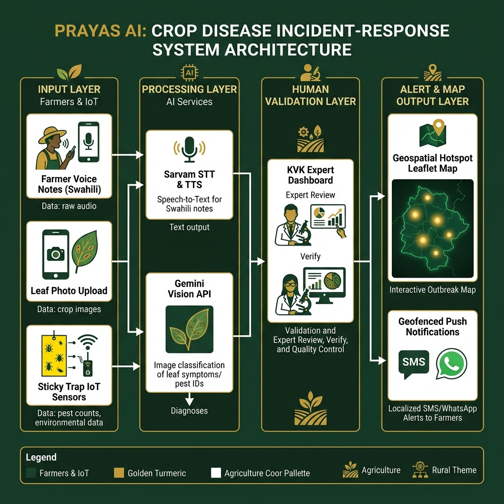

# Prayas AI — खेती साथी (Smart Crop Incident Response System)

[](https://prayas-ai.netlify.app/)
[](https://prayas-ai.netlify.app/)
[](LICENSE)

**Prayas AI** is a voice-first, community-driven Progressive Web App (PWA) designed for the early detection, forecasting, and localized management of crop diseases and pest infestations. 

Developed for **Problem Statement ID 26131** under the **Government of Maharashtra (Department of Skills, Employment, Entrepreneurship and Innovation)** for the *Agriculture, FoodTech & Rural Development* track.

---

## 1. Project Vision & Closed-Loop Architecture

While many tools exist for standalone disease diagnosis, they lack a unified action response system. **Prayas AI** closes the loop by connecting farmers, sensors, AI, and agricultural experts into a single, trust-gated system:

```
[Farmer Scan / IoT Sensor Input] 
               │
               ▼
   [Gemini Multimodal Vision] ──(Low Confidence)──► [KVK Expert Review Queue]
               │                                                │
       (High Confidence)                                    (Verified)
               │                                                │
               ▼                                                ▼
     [Community Geo-Grid Map] ◄────────────────────── [Red Alert Broadcast]
               │
               ▼
  [Feasibility Action Planner] (Transport-adjusted Mandi Prices & Nearest Store)
               │
               ▼
     [48-Hour Outcome Survey] ──(Condition Worse)──► [Escalate to Expert]
```

### Key Differentiators
1. **Human-in-the-Loop Validation**: To prevent false-alert fatigue, low-confidence AI scans and grid-level escalations are routed to the **Krishi Vigyan Kendra (KVK) Expert Dashboard** for verification before alerts are broadcast.
2. **Hyperlocal Threshold-Gated Alerts**: Risk tiers (Green → Yellow → Orange → Red) escalate dynamically on a Leaflet map only when clusters of reports occur within a 1.5km grid cell.
3. **Feasibility-Aware Action Planner**: Recommendations include safe/organic inputs (e.g. Neem oil), cost estimates per acre, specific application timings, and links to the nearest seed dealers (e.g. *Nashik Krishi Kendra*).
4. **Transport-Cost Adjusted Mandi Prices**: Free Agmarknet/e-NAM rates are adjusted for travel distance and freight cost (₹3.5/km/quintal) so farmers compare *net profit* rather than raw prices.

---

## 2. System Dataflow Diagram

The diagram below represents how agricultural data flows from the field, through AI processors and expert gates, to community alerts:



---

## 3. Core Features

### 🎙️ Multilingual Voice Assistant (Sarvam AI)
- **Speech-to-Text (STT)**: Uses Sarvam's `saaras:v3` model to transcribe spoken queries in **Hindi, Marathi (तुमचा आवाज, तुमची शेती)**, or English.
- **Text-to-Speech (TTS)**: Uses Sarvam's `bulbul:v3` model (featuring natural speaker voices like *Shubh* for Hindi and *Ananya* for Marathi) to read advisories out loud.
- **Accessibility**: Includes a manual text type-in search field for silent search.

### 📷 Smart Image Diagnosis (Gemini 1.5 Flash)
- Captures crop leaf photos directly from camera/gallery.
- Outputs structured diagnostic data (probable disease, confidence rate, alternative causes, and action plan) using Gemini's multimodal reasoning.

### 🛰️ IoT Sensors & Pest Traps Integration
- Real-time simulated widgets display data from **Yellow Sticky Traps** (insect activity), **Soil Moisture**, and **Leaf Wetness** sensors.
- Automatically updates risk thresholds and recommends preventative actions (e.g., irrigating when soil moisture drops below 35%).

### 🌦️ Weather-Based Disease Risk Forecast
- Fuses local temperature and humidity indicators to calculate disease-specific outbreak risks (e.g. wet leaves + humidity > 85% = High Late Blight risk).

### 🗺️ Community Risk Heatmap
- Geospatial Leaflet map indicating risk circles. Exact farm plots are jittered to a village/grid level to preserve farmer privacy.

---

## 4. Technical Architecture (Open-Source AI Stack)

- **Frontend**: Vanilla HTML5, CSS3, Javascript (PWA with Service Worker offline shell caching).
- **Backend Map**: Leaflet.js mapping library (OpenStreetMap tiles).
- **AI Backend Engine**: FastAPI (Python 3.10+) serving open-source AI models and PWA static assets.
- **Crop Vision Diagnosis**: Fine-tuned **LLaVA-1.5-7B** / **SmolVLM** trained on Kaggle Indian crop disease datasets (replaces Google Gemini).
- **Voice Assistant**: **`sarvamai/sarvam-1`** (2B Indic LLM on Hugging Face) for regional farming Q&A.
- **Voice Engine (STT & TTS)**: OpenAI **Whisper** (Speech-to-Text) and **Edge-TTS** (Text-to-Speech in authentic Marathi `mr-IN-AarohiNeural` and Hindi `hi-IN-MadhurNeural`), 100% free with zero API keys required.
- **Database**: Local JSON storage fallback or Supabase PostgreSQL.

---

## 5. Free Deployment & Running Locally

For complete free deployment guides on **Hugging Face Spaces** (Free Docker 16GB RAM) and **Render Free Tier**, see [DEPLOYMENT.md](DEPLOYMENT.md).

### Run Locally with Open-Source Backend (No Cloud Keys Required)

```bash
# 1. Install dependencies
pip install -r backend/requirements.txt

# 2. Start the unified AI server & PWA
python backend/main.py
```
Open `http://localhost:8000` in your browser.

---

## 6. Fine-Tuning LLaVA on Kaggle

To train your own LLaVA model on Indian crop disease datasets using Kaggle's free GPU quota:
See [training/README.md](training/README.md) and [training/kaggle_train_llava.py](training/kaggle_train_llava.py).

---

## 7. License

This project is licensed under the MIT License. See [LICENSE](LICENSE) for details.
